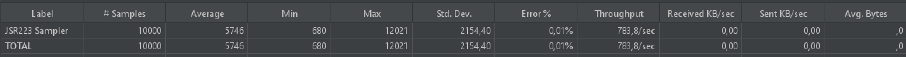

# documentStorage
веб-сервер для сохранения и раздачи электронных документов

## Содержание
- [documentStorage](#documentStorage)
- [содержание](#содержание)
- [Архитектура](#архитектура)
- [Локальный запуск](#локальный-запуск)

## Архитектура

Проект основан на "трехслойной" архитектуре и разработан на языке Go. Реализованная архитектура включает три основных слоя: handler, service и repository. В слое handler обрабатываются HTTP-запросы, слой service содержит бизнес-логику, а в слое repository выполняются операции с PostgreSQL и Redis.

В этом репозитории представлена базовая реализация задачи, в которую можно добавлять улучшения как в области безопасности, так и производительности. Основной целью было познакомиться с новыми технологиями и реализовать нестандартные методы, так как делать шаблонные решения - скучно)

Данное решение предполагает, что размеры входных данных не превышают 2 МБ. Это ограничение позволяет использовать базу данных PostgreSQL в качестве хранилища файлов. В таком случае она идеально подходит для решения данной задачи, так как обладает широкими возможностями для написания производительного кода.

В проекте реализовано всего два unit-теста, которые служат иллюстрацией того, как их следует писать (остальные тесты писать лень:). Кроме того, было проведено нагрузочное тестирование на GET-запросы, так как задание предполагает, что система должна выдерживать значительную нагрузку при получении списков и файлов. Система успешно справилась с 10,000 запросами в секунду!

## Локальный запуск
В этот раз решил не использовать Docker и docker-compose, но возможно Docker понадобится для подключения к БД.

**Важно:** Перед запуском убедитесь, что вы установили пароли. Для этого создайте файл .env в корневой директории и добавьте туда:\
`DB_PASSWORD=...`

`REDIS_PASSWORD=...`

`REGISTRATION_TOKEN=rfjn4289jnd892vjdsi92uvhnjd8f`

1. `git clone --recurse-submodules https://github.com/klausfun/documentStorage`
2. `cd documentStorage`
3. `docker pull postgres` - для скачивания образа postgres
4. `docker run --name=docStorage-db -e POSTGRES_PASSWORD='<тут ваш пароль>' -p 5436:5432 -d --rm postgres` - заменить <тут ваш пароль> на необходимый пароль
5. `migrate -path ./schema -database 'postgres://postgres:<тут ваш пароль>@localhost:5436/postgres?sslmode=disable' up` - заменить <тут ваш пароль> на необходимый пароль
6. `docker run --name=redis-server -p 6379:6379 -d --rm redis --requirepass <тут ваш пароль>` - заменить <тут ваш пароль> на необходимый пароль
7. `go run cmd/main.go`